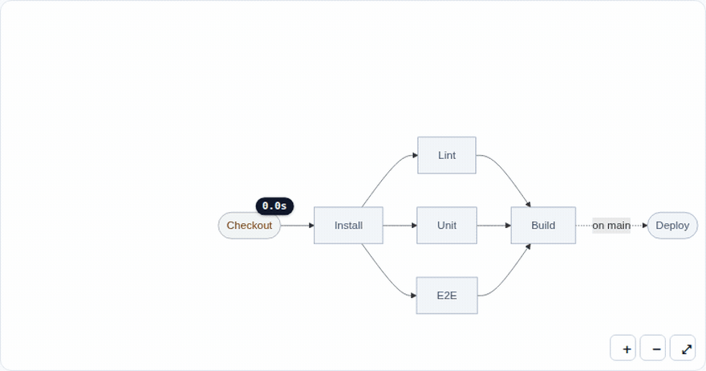

# live-diagram

**Turn a Mermaid diagram into a live control surface.**

[](LICENSE)




Mermaid renders a picture of your system. **live-diagram makes that picture the
system's control panel.** Bind any diagram to a live state source — nodes light
up as work runs, carry badges and data, and emit clicks back to your app.
One small library: your graph in, an interactive, real-time, replayable diagram out.

**[▶ Try the demos](https://mistamid.github.io/live-diagram/demo/)** — start with the
[playground](https://mistamid.github.io/live-diagram/demo/playground.html) (paste your own Mermaid,
add state, share the URL), then a
[CI pipeline](https://mistamid.github.io/live-diagram/demo/pipeline.html) running live, a
[GitHub Actions run](https://mistamid.github.io/live-diagram/demo/github-actions.html) drawn from the
API, a [state machine](https://mistamid.github.io/live-diagram/demo/state-machine.html) you drive by
clicking, a [run replay](https://mistamid.github.io/live-diagram/demo/replay.html) you can scrub, a
[health map](https://mistamid.github.io/live-diagram/demo/infra.html) fed by a poller.
Or open [`starter.html`](starter.html) from a clone — one file, no build.

---

## Why

Every engineering team already has diagrams, and almost all of them are dead: a
rendered SVG that was accurate the day it was committed, sitting in a README
next to the thing it describes.

The pieces that would make one live are individually easy and collectively
annoying — re-rendering without losing zoom and pan, keeping click handlers
alive across renders, mapping SVG elements back to node ids, not re-parsing a
whole diagram to recolour one box, theme switching, a timeline. That is what
this library is: the fiddly parts, written once (a good third of it comments),
already load-bearing in a real application.

```js
diagram.patch({ build: 'success', test: { state: 'running', badge: '4.2s' } });
```

And the diagram you already have is the diagram you keep:

```js
new LiveDiagram({ mount: '#diagram', graph: `flowchart LR
  ingest[Ingest] --> validate{Valid?}
  validate -- yes --> load[(Warehouse)]
  validate -- no  --> quarantine[[Quarantine]]` });
```

## Install

```bash
npm install live-diagram
```

…or skip the toolchain entirely. The UMD build works from a `<script>` tag and
declares no dependencies of its own:

```html
<div id="diagram" style="height: 420px"></div>

<script src="https://cdnjs.cloudflare.com/ajax/libs/mermaid/10.9.1/mermaid.min.js"></script>
<script src="https://unpkg.com/live-diagram/dist/live-diagram.umd.min.js"></script>
<script>
  const diagram = new LiveDiagram({
    mount: '#diagram',
    graph: {
      direction: 'LR',
      nodes: {
        build: { label: 'Build' },
        test:  { label: 'Test' },
        ship:  { label: 'Ship', shape: 'stadium' }
      },
      edges: [{ from: 'build', to: 'test' }, { from: 'test', to: 'ship' }]
    }
  });

  diagram.patch({ build: 'success', test: { state: 'running', badge: '4.2s' } });
  diagram.on('nodeClick', ({ id, state }) => console.log(id, 'is', state));
</script>
```

Mermaid is a **peer** dependency: bring your own, any version from 10 up. ESM
users import from source (`import { LiveDiagram } from 'live-diagram'`) and get
tree-shakeable modules and TypeScript declarations. React users can skip the
effect entirely:

```jsx
import { LiveDiagramView } from 'live-diagram/react';

<LiveDiagramView graph={graph} patch={{ build: 'success' }} onNodeClick={({ id }) => select(id)} />
```

## Three ways to embed it

**The class** — everything below, and what the other two are built on.

**The custom element** — one tag, no framework, works in React, Vue, Svelte, Astro, Rails, Django
and every documentation site:

```html
<live-diagram height="380px" controls
  graph='{"nodes":{"a":"Alpha","b":"Beta"},"edges":[{"from":"a","to":"b"}]}'></live-diagram>
```

It also takes `src="/runs/latest.json"` and `fit="observe"` — refit whenever its box resizes,
until the user zooms by hand — and emits `nodeclick` as an ordinary DOM event.

**Hydration** — for documentation, where the author writes a block and never touches JavaScript.
Add `data-auto` to the script tag and every recognised block on the page becomes a diagram:

```html
<script src="https://unpkg.com/live-diagram/dist/live-diagram.umd.min.js" data-auto></script>
```

~~~markdown
```live-diagram
{ "graph": { "nodes": { "a": "Alpha", "b": "Beta" }, "edges": [{ "from": "a", "to": "b" }] },
  "events": [{ "t": 0, "node": "a", "state": "running" }, { "t": 800, "node": "a", "state": "success" }] }
```
~~~

The fence is recognised wherever your site puts the language class — on the `<code>`, the `<pre>`
or a wrapping `<div>` — and a `<script type="application/live-diagram+json">` block works even on
sites that strip it. A spec carrying `events` is replayable, and shows the recorded end state at
rest. See **[integrations/](integrations/)** for Docusaurus, VitePress, MkDocs and Astro, including
the one-line fix each single-page docs site needs.

## The idea

The contract is two sentences long:

1. **`patch()` is the only way state changes.**
2. **The library never mutates the graph you gave it.**

Replay, live streaming, run diffing and "click a node to do something" all fall
out of those two rules, which is why the API is small enough to read in one
sitting.

### Bring your own Mermaid

`graph` takes a flowchart definition as well as an object, so nothing has to be translated first:
shapes, every edge form, inline and pipe labels, chains, `&` groups and subgraphs all survive. Ids
Mermaid allows but this library cannot are rewritten consistently (`my-node` → `my_node`), and both
ends of every edge follow. A `sequenceDiagram` is refused by name rather than half-drawn.

The same is true wherever a graph is accepted: `setGraph()`, the `<live-diagram graph="…">`
attribute, and a fenced `live-diagram` block in your docs may all hold source instead of JSON.
`parseMermaid(source)` is exported if you want the graph object itself.

### State diagrams too

`stateDiagram-v2` source is parsed as well as flowcharts — which matters, because a state machine
is the thing most people want to make live:

```js
new LiveDiagram({ mount: '#diagram', graph: `stateDiagram-v2
  [*] --> Idle
  Idle --> Running : start
  state Running {
    [*] --> working
    working --> [*]
  }
  Running --> [*]` });
```

`[*]` becomes a start or stop node per scope, composite states become groups, and a transition
naming a composite is redirected to its start or stop. Notes are read and discarded.

### Structure is not state

A **graph** describes what the boxes *are* — labels, shapes, edges, groups. It
is static, and the library freezes it.

A **state vocabulary** maps a status name to a visual treatment, declaratively:

```js
const states = {
  running: { icon: '▶', style: 'fill:#fef9c3,stroke:#ca8a04', darkStyle: 'fill:#854d0e,stroke:#facc15' },
  success: { icon: '✓', style: 'fill:#dcfce7,stroke:#16a34a', darkStyle: 'fill:#14532d,stroke:#4ade80' }
};
```

This is the idea most worth stealing. Once "how a running node looks" is config,
a design change is a config change, a new status is a new key, and the renderer
never grows a branch. Colours may be written as `rgb()` / `rgba()` / `hsl()` too —
they are rewritten to hex when the vocabulary is built, because Mermaid's style
grammar cannot parse a comma inside a declaration. A sensible default vocabulary (`idle`, `queued`,
`running`, `waiting`, `success`, `error`, `skipped`) ships in the box, with light
and dark treatments for each, so a diagram renders before you decide anything.

Your own vocabulary does not have to be about jobs at all — the
[state machine demo](demo/state-machine.html) uses `current` / `visited` /
`available` / `unreachable`.

### State goes in through one door

```js
diagram.patch({ build: 'running' });                          // shorthand
diagram.patch({ build: { state: 'success', badge: '4.2s' } }); // with a badge
diagram.patch({ build: { data: { exitCode: 0 } } });           // payload, no visual change
diagram.patch({ build: { badge: null } });                     // clear
```

A patch reports whether it was *structural* (a node changed state) or merely
decorative (a badge moved). State changes take the **fast path**: the existing
SVG is repainted in place rather than re-parsed, so a run does not make your
canvas flash and a ticking duration badge never re-lays-out the graph.

### Edges have state too

Structure-only edges leave out the thing half of these diagrams are about — which path traffic took,
which dependency is failing, which branch ran. Every edge is addressable as `from->to` (or an
explicit `id`, needed only for parallel edges) and goes through the same door:

```js
diagram.patch({ api: 'degraded', 'api->db': 'error', 'edge->gateway': { state: 'up', data: { rps: 412 } } });
diagram.on('edgeClick', ({ from, to, state, data }) => { … });
```

A state's edge treatment comes from `edgeStyle` / `darkEdgeStyle`, which default to the state's own
stroke colour, so a vocabulary that only describes nodes still colours edges sensibly. Edges repaint
in place like nodes, and a `running` edge animates its dash.

### Anything can hang on a node

Badges are the smallest thing you can attach to a node. `overlay()` opens the same machinery up to
anything you can put in a div — a progress bar, a sparkline, an avatar, a retry button, a line of
streaming output:

```js
const bar = diagram.overlay('build', '<progress max="100" value="0"></progress>', { position: 'bottom' });
bar.querySelector('progress').value = 60;      // it returns the element, because you keep using it

const retry = document.createElement('button');
retry.onclick = () => rerun('build');
diagram.overlay('build', retry, { position: 'top-right', offset: [0, -4] });
```

Nine anchor points (`top-left` … `bottom-right`, `center`), it survives re-renders, follows zoom and
pan, and hides itself if its node is not in the current graph. The library positions your element
and never draws its contents.

### Events come back out

```js
diagram.on('nodeClick', ({ id, node, state, badge, data, element }) => { … });
diagram.on('nodeHover', (payload) => { … });   // null on leave
diagram.on('change', ({ changed, structural, snapshot }) => { … });
diagram.on('render', ({ nodes, definition }) => { … });
diagram.on('error',  ({ source, error }) => { … });
```

Clicks are delegated from the container rather than wired through Mermaid's
`click` directives: they survive re-renders, need no global callback name, and
are unaffected by `securityLevel`. Nodes are also real keyboard buttons —
`tabindex`, `role="button"`, Enter/Space, and an `aria-label` carrying the
current state.

### The timeline

Because state only ever arrives as an ordered stream of patches, the component
that renders *now* can render any earlier moment:

```js
const tl = diagram.timeline(events);   // [{ t, node, state, badge? }] or [{ t, patch }]

tl.seek(4200);                 // fold everything up to t = 4.2s
tl.step();                     // exactly one event
tl.play({ speed: 2, loop: true });
tl.pause(); tl.reset();
```

Backwards seeks refold from zero rather than guessing an inverse, so scrubbing
is exactly as correct in both directions. See the
[replay demo](demo/replay.html).

### Sources

A source is anything with `start(emit)` and `stop()`. Three ship because they
cover most of it; a fourth is fifteen lines of your own code.

```js
import { webSocketSource, eventSourceSource, pollSource } from 'live-diagram';

// Translate your protocol into patches. Return null to ignore a message.
diagram.connect(webSocketSource('wss://ci.example.com/events', {
  parse: (msg) => (msg.type === 'node_status' ? { [msg.nodeId]: msg.status } : null)
}));

diagram.connect(pollSource(() => fetch('/health').then((r) => r.json()), { interval: 1500 }));
```

`connect()` returns a detach function. `webSocketSource` reconnects; `pollSource`
chains its timer so a slow poll never stacks.

## Getting it back out

```js
import { toSVG, toPNG, download, shareUrl, applyShared } from 'live-diagram';

const svg = toSVG(diagram, { background: '#fff' });   // standalone, badges redrawn into the SVG
await download(diagram, { format: 'png', filename: 'run.png', scale: 2 });

location.hash = shareUrl(diagram, { graph: source }).split('#')[1];
applyShared(diagram);                                  // on the other end
```

Two honest limits. Overlay content is arbitrary HTML and cannot be carried into an SVG (badges are
redrawn; overlays are not). And PNG rasterisation cannot render Mermaid's default HTML labels, so
`toPNG` **refuses** rather than handing you a wordless picture — render with
`mermaidRenderer({ svgLabels: true })` and it works. A sandboxed page (a Claude artifact, some
embeds) blocks downloads it did not initiate; there, hand the user `toSVG()` instead.

## The kit

Optional components, built from data the diagram already holds. Every demo in this repository used
to hand-roll these, which is how they earned their place:

```js
import { legend, inspector, transport } from 'live-diagram';

legend(diagram, { mount: '#legend', hideUnused: true });     // swatches + live counts
inspector(diagram, { mode: 'tooltip' });                      // hover card; 'panel' for a sidebar
transport(diagram, diagram.timeline(events), { mount: '#transport', speed: 2 });
```

Each returns `{el, destroy()}`, styles itself from the same tokens as the diagram, and unsubscribes
cleanly. `inspector` takes a `template(payload)` if the default list of fields is not what you want.
The core does not know they exist.

## API

### `new LiveDiagram(options)`

| Option | Type | Default | What it does |
|---|---|---|---|
| `mount` | `Element \| string` | — | Where to render. Required. |
| `graph` | `object \| string` | — | `{direction, nodes, edges, groups}` or Mermaid source. Required. |
| `states` | `object` | defaults | State vocabulary, merged over the built-in one |
| `extendStates` | `boolean` | `true` | `false` starts from an empty vocabulary |
| `initial` | `object` | — | A patch applied before the first render |
| `defaultState` | `string` | `'idle'` | State for nodes nobody has spoken about |
| `renderer` | `object` | `mermaidRenderer()` | Renderer adapter |
| `theme` | `'light' \| 'dark' \| 'auto'` | `'auto'` | `auto` follows `data-theme` then `prefers-color-scheme` |
| `showIcons` | `boolean` | `false` | Prefix labels with the state icon (costs the fast path) |
| `controls` | `boolean` | `false` | Built-in zoom / fit buttons |
| `autoFit` | `boolean \| 'observe'` | `true` | Fit once after the first render; `'observe'` keeps refitting as the container resizes, until the user zooms by hand (ignored in bare mode); `false` never fits |
| `strict` | `boolean` | `false` | Throw on patches naming unknown nodes instead of reporting them |
| `viewport` | `object \| false` | — | `{min, max, step, pan, wheelZoom, maxFitScale}`; `false` is **bare mode** — no scroller, no pan, no wheel zoom, for hosts that already scroll |

### Methods

| Method | Returns | Notes |
|---|---|---|
| `patch(patch)` | `this` | The one way state changes |
| `setState(id, state)` | `this` | Shorthand for one node |
| `badge(id, text)` | `this` | `null` clears |
| `data(id, payload, merge)` | `this` | Arbitrary payload per node |
| `get(id)` | `{state, badge, data}` | |
| `getEdge(id)` | `{state, data}` | Edges are addressed `from->to` |
| `overlay(id, content, opts)` | `Element` | Anchors HTML to a node; `null` removes |
| `clearOverlays()` | `this` | Badges are state, and stay |
| `connection` / `lastUpdate` | `string` / `number` | `'live' \| 'stale' \| 'none'` |
| `snapshot()` | `{states, badges, data}` | A copy, safe to keep |
| `restore(snapshot)` | `this` | Wholesale state replacement |
| `clear()` | `this` | Back to the default state |
| `setGraph(graph)` | `this` | Keeps the state of nodes that still exist |
| `setStates(states)` | `this` | Swap the vocabulary |
| `setTheme(theme)` | `this` | |
| `timeline(events)` | `Timeline` | |
| `connect(source)` | `function` | Returns detach |
| `fit()` / `zoom(n)` / `zoomIn()` / `zoomOut()` / `resetView()` | `this` | |
| `definition()` | `string` | The current Mermaid source — handy for export and debugging |
| `svg()` | `string` | The current SVG markup |
| `render()` | `Promise` | Force a full re-render |
| `destroy()` | — | Detaches sources, timers, listeners and DOM |

Also exported: `Timeline`, `StateStore`, `Viewport`, `Emitter`, `parseMermaid`, `parseStateDiagram`,
`toSVG`, `toPNG`, `download`, `shareUrl`, `applyShared`, `encodeState`, `decodeState`,
`buildDefinition` (graph + state → Mermaid source, a pure function),
`normalizeGraph`, `normalizeStates`, `diffSnapshots`, `tagNodes`, `tagEdges`,
`toTimelineEvents`, `graphFromEvents`, `legend`, `inspector`, `transport`,
`DEFAULT_STATES`.

## Adapters

Something you already run has the run data; the adapter turns it into a diagram.

```js
import { fromGitHubActions } from 'live-diagram';

const payload = await fetch(`https://api.github.com/repos/${repo}/actions/runs/${id}/jobs`,
  { headers: { accept: 'application/vnd.github+json' } }).then((r) => r.json());

const { graph, states, initial, events, meta } = fromGitHubActions(payload);
const diagram = new LiveDiagram({ mount: '#run', graph, states, initial });
diagram.timeline(events).play({ speed: 12 });    // watch last night's run again
```

GitHub does not return the `needs:` graph, so stages are inferred from start times and rendered as
subgraphs; pass `{ needs }` from your workflow YAML for exact edges, or
`{ mode: 'steps', job }` to draw one job's steps.

For anything else that writes a row per state change — a JSONL run log, a `status_history` table,
an in-house scheduler — `toTimelineEvents(rows, mapping)` is a naming exercise rather than a parser,
and `graphFromEvents(events)` will even recover a first-seen chain when you have a log but no
declared structure:

```js
import { toTimelineEvents, graphFromEvents } from 'live-diagram';

const events = toTimelineEvents(rows, { time: 'ts', node: 'step', state: 'phase' });
const diagram = new LiveDiagram({ mount: '#run', graph: graphFromEvents(events) });
diagram.timeline(events).play({ speed: 4 });
```

## Recipes

**Diff two runs.** Snapshots are plain data, so comparing runs is one call:

```js
import { diffSnapshots } from 'live-diagram';

const tl = diagram.timeline(yesterdaysEvents);
tl.seek(tl.duration);
const yesterday = diagram.snapshot();

diagram.restore(todaysSnapshot);
diffSnapshots(yesterday, diagram.snapshot());
// [{ node: 'e2e', from: 'success', to: 'error' }]
```

**Replay a JSONL run log.** Map your rows once, then hand them to the timeline:

```js
import { toTimelineEvents } from 'live-diagram';

const events = toTimelineEvents(rows, {
  time: 'ts', node: 'nodeId', state: 'status',
  badge: (row) => (row.durationMs ? `${(row.durationMs / 1000).toFixed(1)}s` : undefined)
});
diagram.timeline(events).play({ speed: 4 });
```

**Use it from a framework.** There is no framework binding to learn — it is a
plain class with an emitter:

```jsx
useEffect(() => {
  const diagram = new LiveDiagram({ mount: ref.current, graph });
  const off = diagram.on('nodeClick', ({ id }) => setSelected(id));
  return () => { off(); diagram.destroy(); };
}, []);
```

**Swap the renderer.** A renderer is an object with `render({container, graph,
snapshot, states, theme})` returning `{nodes: Map<id, Element>}`, and an optional
pure `definition()`. Mermaid is the first one, not the architecture.

## Performance

- A state change repaints the existing SVG; only a structural change (new graph,
  new vocabulary, theme swap, or `showIcons` with a state change) re-parses.
- Renders are coalesced to one per animation frame, so a burst of patches costs
  one paint.
- Badges are HTML chips positioned over the SVG, not text baked into labels —
  a counter that ticks ten times a second never triggers layout.
- `dist/live-diagram.umd.min.js` — the file a `<script>` tag loads — is **~22 KB gzipped**
  (69 KB raw), and that is everything: both parsers, the adapters, the kit and the exporters.
  A source map ships beside it, so a stack trace still lands on real code.
- The unminified `.umd.js`, `.cjs` and `.esm.js` twins stay in the package for bundlers and for
  Node, which read them and do not care about bytes. A bundler that tree-shakes and minifies
  pulls ~15 KB gzipped for the class and the renderer alone.
- Those numbers are enforced, not remembered: `npm run size` checks each artifact against a
  ceiling declared in `package.json#sizeLimits` and CI fails on a breach.

## Agent skills

[`skills/`](skills/) holds four skills — embed, from-data, troubleshoot, release — for
Claude Code, Cowork, or any tooling that reads `SKILL.md` folders. Copy them into
`~/.claude/skills/` (or a project's `.claude/skills/`) and your assistant knows how to wire
this library without re-deriving it from this README. Their claims about the API are checked
by the test suite the same way this README's are, so a skill cannot quietly go stale.

## The DOM contract

What `mount` gets is a stable, documented structure — style it freely, but these are the
load-bearing parts:

```text
.ld                the component root; paints var(--ld-bg, transparent)
  .ld-viewport     the scroller — overflow auto, grid centering, 12px padding
    .ld-canvas     an inline-block that shrink-wraps the svg
      svg          Mermaid's output; the library owns its inline width,
                   and that width IS the zoom (viewBox size × scale)
    .ld-overlay    badges and overlay() content, absolutely positioned
  .ld-controls     the optional zoom buttons
```

(In bare mode — `viewport: false` — there is no `.ld-viewport`: the root itself holds the
canvas and overlay, and scrolling belongs to the host.)

Two rules keep fit and zoom honest: never size the `svg` inside `.ld` from your own CSS —
its inline width is the zoom mechanism — and never assume a transform; there is none, which
is why the layout box, the scrollbars and the centering always agree with what you see.

Theming has a boundary in the same spirit: **`setTheme()` themes the diagram box, never your
page.** It flips `data-theme` on `.ld`, which switches the control and badge palettes and
re-renders with the vocabulary's `darkStyle`s. The surface itself is `--ld-bg` (default
transparent): set it on any ancestor — typically wherever your own dark-mode class lives — and
the diagram's ground follows your page with one custom property. The other knobs are custom
properties too: `--ld-badge-bg`, `--ld-badge-fg`, `--ld-control-bg`, `--ld-control-fg`,
`--ld-control-border`, `--ld-focus`, `--ld-stale-opacity`. Node and edge colours are **not**
CSS-reachable — Mermaid compiles them from the vocabulary's `style`/`darkStyle` strings into
SVG presentation attributes — so restyling a state means editing the vocabulary, not a
stylesheet.

## What this is not

- **Not a diagram editor.** No drag-to-create, no layout engine — Mermaid does layout.
- **Not a workflow engine.** It renders state; it does not decide state.
- **Not a Mermaid fork.** It sits on top and stays on top.
- **Not a framework.** Plain class, plain events; the element and the React binding are wrappers.
- **Not a Mermaid feature detector.** It emits flowchart syntax; sequence and class diagrams are
  not state machines and are out of scope.

## Development

```bash
npm run build          # dist/ — ESM + UMD + types, from a dependency-free script plus tsc
npm test               # Node suites: the DOM-free core and the adapters
npm run test:browser   # Playwright: real Mermaid, real SVG, real clicks, the element, hydration
npm run demo           # http://localhost:8080/demo/index.html
node scripts/record-demo.mjs   # regenerates the GIF above
node scripts/set-repo.js <owner>/<repo>   # stamps the repository URLs once
```

[`AGENTS.md`](AGENTS.md) covers the codebase's invariants, and
[`llms.txt`](llms.txt) is a compressed integration guide for whatever assistant your users bring.
[`RELEASING.md`](RELEASING.md) covers publishing: the tag-driven npm workflow, the Pages deploy,
and what CI checks before either.

The core is deliberately DOM-free — graph model, state store, patch diffing,
timeline and the Mermaid definition builder are pure and tested in Node. Only
the renderer, viewport and overlay touch a document, and those are covered by
the browser suite.

## Where this came from

Extracted from a production workflow tool whose primary interface is a Mermaid
flowchart — clicking a node runs it, and the graph *is* the UI. Every piece here
had to survive that job first, which is why the API is shaped around pushing a
stream of state at a diagram rather than around drawing one.

## Licence

MIT.
